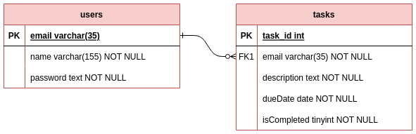

# IJSE DATABASE PROGRAMMING FINAL

### Table of content. 🚩

- How to get the repository.
- How to run the project.
- Project overview.
  - Key features.
  - Technology stack.
- Entity Relationship diagram.
- What you have to do?
- How to submit.
- License🛡️.

### How to get repository.
1. Install Git on your computer, if not: https://git-scm.com/downloads
2. Then open your terminal. Run 👇

```sh
git clone https://github.com/danujav/todo-jdbc-assessment.git
```

### How to run the project.
1. Open the project in IntelliJ IDEA.
2. Go to the `pom.xml > right click > maven > Reload project`
3. Run `LauncherWrapper`.

### Project overview.
The To-Do List Application is a simple, user-friendly task management tool designed to help individuals organize and keep track of their tasks and responsibilities. This project aims to create a Java standalone To-Do list application that allows users to efficiently manage their tasks, see tasks, and mark tasks as completed.

#### Key features.
- User registration and authentication:
  - A new user can register to the system if he/she is not already registered.
  - A registered user can log in to the system through the login form.
  - It should check the user's credentials and allow the user to log in if the credentials are correct.
  - A user can log out of the system.
- Task management:
  - User can add a new task to the system. (Task id, description, and due date)
  - User can delete due or completed tasks if he/she wants to.
  - User can mark a due task as completed.
- Task List Views:
  - User can view all the due tasks.
  - User can view all the tasks that are completed.
- Notifications:
  - User can view the number of due tasks in the system.
  - User can view the number of completed tasks in the system.

#### Technology stack.
- Language: Java 11+
- Database: MySQL 8.x
- Database driver: MySQL Connector/Java 8.x
- Database access: JDBC
- Build tool: Maven
- IDE: IntelliJ IDEA
- UI: JavaFX
- UI design: Scene Builder
- Version control: Git
- Code hosting: GitHub

### Entity Relationship diagram.



### What you have to do?
1. In this project, already have created the UI. So you don't have to worry about the UI with navigations.
2. You need to implement the database with help of given ER diagram.
3. You need to use `Singleton` design pattern to create the database connection.
4. Use `DTO` design pattern to pass the `Task`, `User` data between layers.
5. Use `MVC` design pattern to separate the layers.
6. Finally, you need to implement all the key features mentioned above.

### How to submit.
1. zip the project folder and rename it with your name.
2. Upload the zip file to the Google Classroom before the deadline.
3. Done.

Or

1. Fork the repository.
2. Clone the forked repository to your computer.
3. Commit your changes to the branch.
4. Push the changes to the remote repository.
5. Get the repository link from your repository.
6. Submit the repository link to the Google Classroom before the deadline.
7. Done.

### License🛡️. 
Copyright 2023 IJSE. All Rights Reserved.


